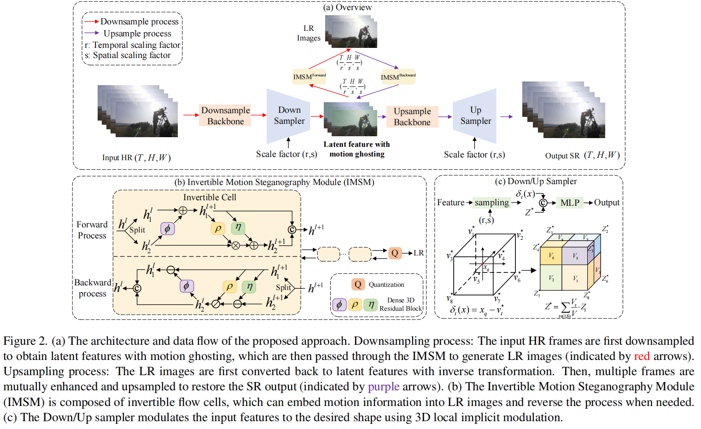
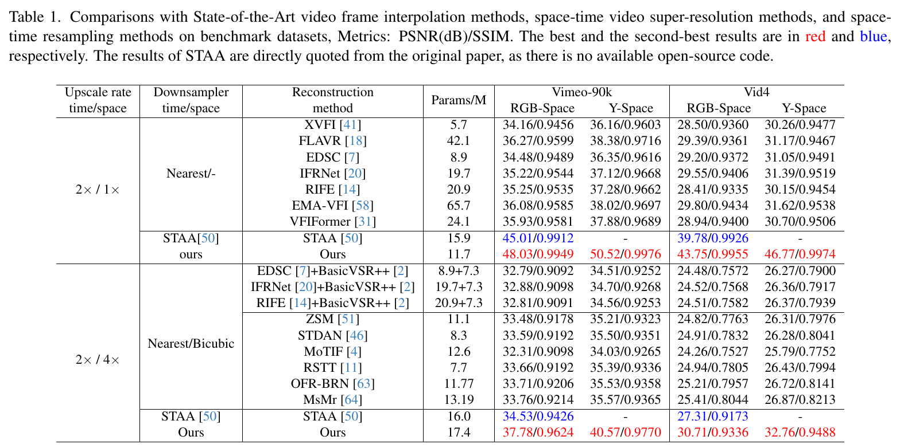

# CVRS 
This is the code of the paper "Continuous Space-Time Video Resampling with Invertible Motion Steganography"

## Introduction

<div style="text-align: justify; word-break: keep-all; hyphens: none;">
Space-time video resampling aims to conduct both spatial-temporal downsampling and upsampling processes to achieve high-quality video reconstruction. Although there has been much progress, some major challenges still exist, such as how to preserve motion information during temporal resampling while avoiding blurring artifacts, and how to achieve flexible temporal and spatial resampling factors.  In this paper, we introduce an Invertible Motion Steganography Module (IMSM), designed to preserve motion information in high-frame-rate videos. This module embeds motion information from high-frame-rate videos into downsampled frames with lower frame rates in a visually imperceptible manner. Its reversible nature allows the motion information to be recovered, facilitating the reconstruction of high-frame-rate videos. Furthermore, we propose a 3D implicit feature modulation technique that enables continuous spatiotemporal resampling. With tailored training strategies, our method supports flexible frame rate conversions, including non-integer changes like 30 FPS to 24 FPS and vice versa.  Extensive experiments show that our method significantly outperforms existing solutions across multiple datasets in various video resampling tasks with high flexibility. 

</div>
 
## Overview
<div align="center">
  
</div>

## Perfromance
<div align="center">
  
</div>

# test code

### test fix-scale space-time video resampling
```
cd src/test

python test_vid4.py --datapath REDSPATH --outputpath  OUTPUTPATH --weight PATHTOWEIGHT
```

### test continuous space-time video resampling
```
cd src/test

python test_contin.py --datapath REDSPATH --outputpath  OUTPUTPATH --weight PATHTOWEIGHT
```

### pretrained weight
[pretrained model]( https://pan.baidu.com/s/1PA7IoclyZsDXA7EhNlGQjA?pwd=8n5e)
password: 8n5e 


# Acknowledgment
Our code is built on

 [Zooming-Slow-Mo-CVPR-2020](https://github.com/Mukosame/Zooming-Slow-Mo-CVPR-2020)

 [open-mmlab](https://github.com/open-mmlab)

 [bicubic_pytorch](https://github.com/sanghyun-son/bicubic_pytorch)

 [IFRNet](https://github.com/ltkong218/IFRNet)

 [EMA-VFI](https://github.com/MCG-NJU/EMA-VFI)
 
 [Galerkin Transformer](https://github.com/scaomath/galerkin-transformer)
 
 We thank the authors for sharing their codes!